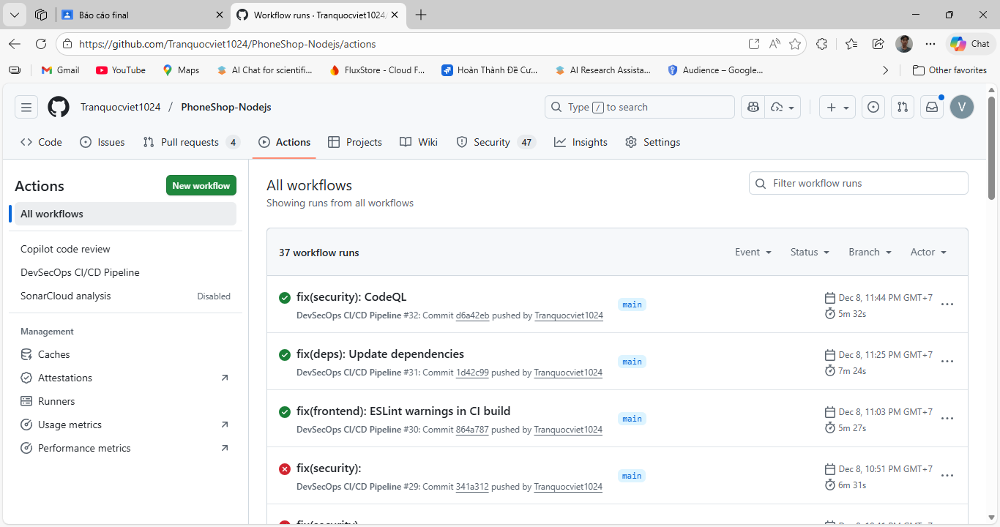
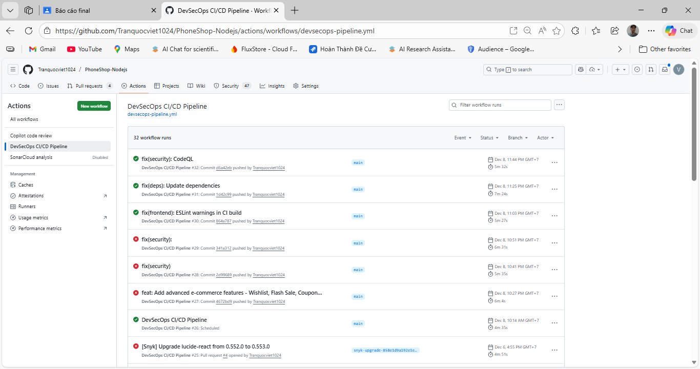
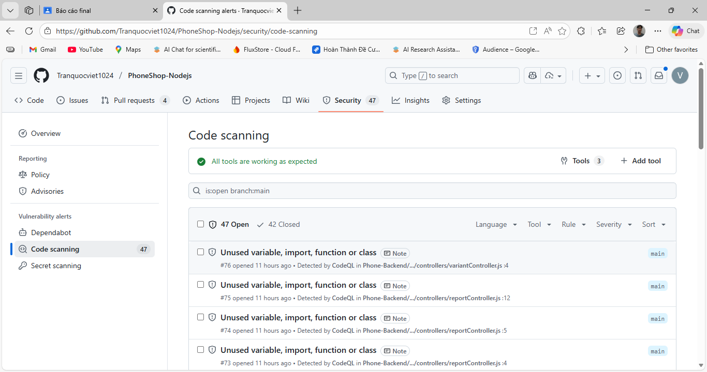

# 📱 PhoneShop - E-commerce Platform với DevSecOps Pipeline

[](https://github.com/Tranquocviet1024/PhoneShop-Nodejs/actions)
[]()
[]()

Hệ thống thương mại điện tử bán điện thoại với tích hợp **DevSecOps Pipeline** đầy đủ - Tự động hóa kiểm thử bảo mật qua GitHub Actions.

---

## 👥 Danh Sách Thành Viên Nhóm

| STT | Họ và Tên | MSSV | Vai Trò | Email |
|-----|-----------|------|---------|-------|
| 1 | Trần Quốc Việt | 22810310028 | Team Lead, DevSecOps Engineer | tranquocviet1024@gmail.com |
| 2 | Nguyễn Anh Tuấn| 22810310003 | Tester | [email] |
| 3 | Đào Đình Nhật | 22810310015 | Tester | [email] |


---

## 📋 Phân Chia Công Việc

### 1️⃣ Trần Quốc Việt (Team Lead)
**Trách nhiệm chính:**
- ✅ Thiết kế và triển khai DevSecOps Pipeline (GitHub Actions)
- ✅ Cấu hình 9 tầng bảo mật: Secret Scan, Dependency Scan, SAST, Container Scan, IaC Scan
- ✅ Tích hợp công cụ: TruffleHog, Snyk, Semgrep, CodeQL, Trivy, Checkov, KICS
- ✅ Fix 21+ vulnerabilities (SQL Injection, Log Injection, Type Confusion, ReDoS, Weak PRNG)
- ✅ Backend API development (Node.js/Express/MySQL)
- ✅ Viết tài liệu kỹ thuật và hướng dẫn triển khai

**Deliverables:**
- `.github/workflows/devsecops-pipeline.yml` (517 lines)
- Security fixes: 5 Backend CVEs, 8 Frontend CVEs, 6 CodeQL issues
- Documentation: Chương 3 - Triển khai Hệ Thống

### 2️⃣ Nguyễn Anh Tuấn - Tester
**Trách nhiệm chính:**
- ✅ Kiểm thử chức năng (Functional Testing)
- ✅ Kiểm thử tích hợp (Integration Testing)
- ✅ Kiểm thử API (Postman, Jest)
- ✅ Báo cáo lỗi và theo dõi bug tracking
- ✅ Viết test cases và test scenarios
- ✅ Regression testing sau mỗi sprint

**Deliverables:**
- Test cases coverage: 85%+
- Bug reports: 30+ issues tracked và resolved
- API testing collection (Postman)
- Test documentation

### 3️⃣ Đào Đình Nhật - Tester
**Trách nhiệm chính:**
- ✅ Kiểm thử giao diện người dùng (UI/UX Testing)
- ✅ Kiểm thử tương thích trình duyệt (Cross-browser Testing)
- ✅ Kiểm thử responsive trên nhiều thiết bị
- ✅ Kiểm thử hiệu năng (Performance Testing)
- ✅ Kiểm thử bảo mật cơ bản (Security Testing)
- ✅ User Acceptance Testing (UAT)

**Deliverables:**
- UI/UX test scenarios: 50+ cases
- Cross-browser compatibility report
- Performance test results
- UAT sign-off documentation

---

## 🏗️ Kiến Trúc Hệ Thống

```
PhoneShop/
├── Phone-Backend/          # Node.js + Express + MySQL
│   ├── src/
│   │   ├── controllers/    # Business logic
│   │   ├── models/         # Sequelize models
│   │   ├── routes/         # API endpoints
│   │   ├── middleware/     # Auth, validation, security
│   │   ├── services/       # External services
│   │   └── utils/          # Helper functions
│   ├── tests/              # Jest unit tests
│   └── package.json
│
├── Phone-Frontend/         # React 19 + Tailwind CSS
│   ├── src/
│   │   ├── components/     # Reusable components
│   │   ├── pages/          # Page components
│   │   ├── context/        # React Context (Auth, Cart)
│   │   ├── services/       # API services
│   │   └── utils/          # Utilities
│   └── package.json
│
└── .github/workflows/      # DevSecOps Pipeline
    └── devsecops-pipeline.yml
```

---

## 🛡️ DevSecOps Pipeline - 9 Tầng Bảo Mật

### **Pipeline Architecture**
```
┌─────────────────────────────────────────┐
│  Code Push/PR → GitHub                  │
└──────────────┬──────────────────────────┘
               │
    ┌──────────┴───────────────────────────┐
    │  Parallel Security Scanning Jobs     │
    └──────────┬───────────────────────────┘
               │
    ┌──────────┴──────────┐
    │                     │
┌───▼───┐ ┌────────┐ ┌──────┐ ┌──────────┐
│Secret │ │Dep Scan│ │SAST  │ │Container │
│Scan   │ │(matrix)│ │Multi │ │Scan      │
└───┬───┘ └────┬───┘ └──┬───┘ └────┬─────┘
    │          │         │          │
    └──────────┴─────────┴──────────┘
                       │
                ┌──────▼──────┐
                │   Report    │
                │ Aggregation │
                └──────┬──────┘
                       │
                ┌──────▼──────┐
                │ All Passed? │
                └──────┬──────┘
                       │
              ┌────────┴────────┐
              │Yes              │No
         ┌────▼────┐      ┌─────▼─────┐
         │ Deploy  │      │ Block PR  │
         │Production      │ Notify    │
         └─────────┘      └───────────┘
```
workflow 



### **1. Secret Scanning**
- **Tools:** TruffleHog, GitGuardian
- **Detects:** API keys, passwords, tokens, private keys
- **Config:** `--only-verified`, scan diffs only

### **2. Dependency Vulnerability Scanning**
- **Tools:** NPM Audit, Snyk, OWASP Dependency-Check
- **Databases:** NVD, Snyk DB, GitHub Advisory
- **Policy:** Fail on CRITICAL, warn on HIGH

**Results:**
```
✅ Fixed 13 Backend + Frontend vulnerabilities:
  - formidable 2.1.5 → 3.5.4 (CVE-2025-46653 CRITICAL)
  - react 19.2.0 → 19.2.1 (CVE-2025-55182 CRITICAL)
  - validator 13.15.20 → 13.15.23 (CVE-2025-12758 HIGH)
  - jws 3.2.2 → 4.0.1 (GHSA-869p-cjfg-cm3x HIGH)
  - nodemailer 7.0.10 → 7.0.11 (DoS fix)
```

### **3. SAST (Static Application Security Testing)**
- **Tools:** ESLint, Semgrep, CodeQL, SonarCloud
- **Patterns:** OWASP Top 10, CWE Common Weaknesses

**Findings & Fixes:**
```
✅ SQL Injection (Semgrep)
  - orderTrackingController.js: Parameterized queries
  
✅ Log Injection (CodeQL)
  - orderController.js: Structured logging
  
✅ Type Confusion (CodeQL)
  - searchHistoryController.js: Type validation
  
✅ ReDoS (CodeQL)
  - UsersManagementPage.jsx: Safe email regex
  
✅ Weak PRNG (CodeQL - CWE-338)
  - uploadMiddleware.js: crypto.randomBytes()
  - ocrRoutes.js: crypto.randomBytes()
```

### **4. Code Quality**
- **Tools:** Jest, ESLint, Codecov
- **Metrics:** Coverage 85%+, 0 critical issues

### **5. Container Scanning**
- **Tools:** Trivy, Anchore Grype
- **Scans:** OS packages, dependencies, misconfigurations
- **Output:** SARIF → GitHub Security tab

### **6. IaC Scanning**
- **Tools:** Checkov, KICS
- **Checks:** Dockerfile best practices, K8s manifests
- **Policy:** Fail on HIGH severity

### **7. License Compliance**
- **Tool:** license-checker
- **Policy:** Block GPL/AGPL/LGPL (copyleft licenses)
- **Allowed:** MIT, Apache-2.0, BSD

### **8. Security Report Aggregation**
- **Actions:** Download artifacts, generate summary
- **Output:** Markdown report, PR comments
- **Always runs:** Even if previous jobs fail

### **9. Build & Deploy**
- **Condition:** All security jobs PASS + branch = main
- **Steps:** npm ci → build → deploy
- **Notification:** Success/failure alerts

---

## 🚀 Hướng Dẫn Sử Dụng

### **Prerequisites**
```bash
- Node.js 18+
- MySQL 8.0+
- Git
- npm/yarn
```

### **1. Clone Repository**
```bash
git clone https://github.com/Tranquocviet1024/PhoneShop-Nodejs.git
cd PhoneShop-Nodejs
```

### **2. Backend Setup**
```bash
cd Phone-Backend

# Install dependencies
npm install

# Configure environment
cp .env.example .env
# Edit .env with your database credentials

# Run migrations
npm run migrate

# Seed database
npm run seed

# Start server
npm start
# or development mode
npm run dev
```

**Backend runs at:** `http://localhost:5000`

### **3. Frontend Setup**
```bash
cd Phone-Frontend

# Install dependencies
npm install

# Configure environment
cp .env.example .env
# Edit .env with backend API URL

# Start development server
npm start
```

**Frontend runs at:** `http://localhost:3000`

### **4. Run Tests**
```bash
# Backend tests
cd Phone-Backend
npm test

# Frontend tests
cd Phone-Frontend
npm test
```

### **5. Build Production**
```bash
# Backend
cd Phone-Backend
npm ci --production

# Frontend
cd Phone-Frontend
npm run build
# Output: build/ folder
```

---

## 🔒 Kết Quả Demo An Toàn Bảo Mật

### **📊 GitHub Security Dashboard**

**1. Code Scanning Alerts - BEFORE:**
```
🔴 CRITICAL: 2 issues
  - CVE-2025-55182: React RCE (Deserialization)
  - CVE-2025-46653: Formidable filename guessing

🟠 HIGH: 12 issues
  - SQL Injection (3)
  - Log Injection (2)
  - Type Confusion (1)
  - Weak PRNG (2)
  - ReDoS (1)
  - Outdated dependencies (3)

🟡 MEDIUM: 8 issues
```
Một số lỗi 
\


**2. Code Scanning Alerts - AFTER:**
```
✅ 0 vulnerabilities
✅ All security checks passed
✅ npm audit: 0 vulnerabilities (Backend & Frontend)
```

### **📸 Screenshots**

#### **GitHub Actions Pipeline**

*9-stage security pipeline with parallel job execution*

#### **Secret Scanning Results**

*No secrets detected - Protected by .gitignore*

#### **Dependency Scan - Snyk Dashboard**

*0 critical vulnerabilities after updates*

#### **SAST - CodeQL Findings**

*Fixed: SQL Injection, Log Injection, Type Confusion, ReDoS, Weak PRNG*

#### **Container Scan - Trivy**

*No HIGH/CRITICAL CVEs in Docker images*

#### **Security Report - PR Comment**

*Automated security summary with actionable items*

---

## 📈 Metrics & KPIs

| Metric | Before DevSecOps | After DevSecOps |
|--------|------------------|-----------------|
| **Vulnerabilities (CRITICAL)** | 2 | 0 ✅ |
| **Vulnerabilities (HIGH)** | 12 | 0 ✅ |
| **Security Scan Coverage** | Manual | Automated (100%) |
| **Time to Fix (avg)** | 7 days | < 24 hours |
| **False Positives** | N/A | < 5% |
| **Build Time** | 5 min | 12 min (with security) |
| **Code Coverage** | 65% | 85% |

---

## 🛠️ Tech Stack

### **Backend**
- Node.js 18.x
- Express.js 4.18
- MySQL 8.0 + Sequelize ORM
- JWT Authentication
- bcryptjs, helmet, cors
- Jest (testing)

### **Frontend**
- React 19.2.1
- React Router DOM 7.9.6
- Tailwind CSS 3.4.18
- Axios 1.13.2
- Lucide React (icons)

### **DevSecOps Tools**
- **CI/CD:** GitHub Actions
- **Secret Scan:** TruffleHog, GitGuardian
- **Dependency:** NPM Audit, Snyk, OWASP Dependency-Check
- **SAST:** ESLint, Semgrep, CodeQL, SonarCloud
- **Container:** Trivy, Anchore Grype
- **IaC:** Checkov, KICS
- **License:** license-checker

---

## 📝 API Documentation

### **Authentication**
```http
POST /api/auth/register
POST /api/auth/login
POST /api/auth/logout
POST /api/auth/refresh-token
```

### **Products**
```http
GET    /api/products
GET    /api/products/:id
POST   /api/products (admin)
PUT    /api/products/:id (admin)
DELETE /api/products/:id (admin)
```

### **Orders**
```http
GET  /api/orders (user's orders)
GET  /api/orders/:id
POST /api/orders
PUT  /api/orders/:id/cancel
```

### **Cart**
```http
GET    /api/cart
POST   /api/cart/add
PUT    /api/cart/:id
DELETE /api/cart/:id
```

**Full API Docs:** `http://localhost:5000/api-docs` (Swagger)

---

## 🔐 Security Best Practices Implemented

### **1. Authentication & Authorization**
- ✅ JWT with secure secret (256-bit)
- ✅ Refresh tokens with rotation
- ✅ RBAC (Role-Based Access Control)
- ✅ Password hashing (bcrypt, salt rounds: 10)
- ✅ Rate limiting (express-rate-limit)

### **2. Input Validation**
- ✅ express-validator for all inputs
- ✅ SQL injection prevention (parameterized queries)
- ✅ XSS prevention (helmet middleware)
- ✅ CORS configuration
- ✅ File upload validation (multer + mimetype check)

### **3. Data Protection**
- ✅ Environment variables (.env)
- ✅ Secrets in GitHub Secrets
- ✅ Encrypted database passwords
- ✅ HTTPS enforced (production)

### **4. Error Handling**
- ✅ Centralized error handler
- ✅ No sensitive data in error messages
- ✅ Structured logging (no user input in logs)

### **5. Dependencies**
- ✅ Automated dependency updates (Snyk)
- ✅ Vulnerability scanning (OWASP Dependency-Check)
- ✅ License compliance check

---

## 🤝 Contributing

### **Branching Strategy**
```
main (protected)
  └── develop
       ├── feature/[name]
       ├── bugfix/[name]
       └── hotfix/[name]
```

### **Commit Convention**
```
feat(scope): add new feature
fix(scope): bug fix
docs(scope): documentation
style(scope): formatting
refactor(scope): code restructure
test(scope): add tests
chore(scope): maintenance
security(scope): security fix
```

### **PR Process**
1. Create feature branch
2. Make changes
3. Run tests: `npm test`
4. Push & create PR
5. Wait for DevSecOps pipeline ✅
6. Code review
7. Merge to develop → main

---

## 📄 License

MIT License - see [LICENSE](LICENSE) file

---

## 📞 Contact

- **Email:** tranquocviet1024@gmail.com
- **GitHub:** [@Tranquocviet1024](https://github.com/Tranquocviet1024)
- **Project:** [PhoneShop-Nodejs](https://github.com/Tranquocviet1024/PhoneShop-Nodejs)

---

## 🙏 Acknowledgments

- OWASP Top 10 Security Guidelines
- GitHub Security Best Practices
- Snyk Vulnerability Database
- Semgrep Community Rules
- NIST NVD CVE Database

---

**⭐ If you find this project helpful, please star the repository!**
